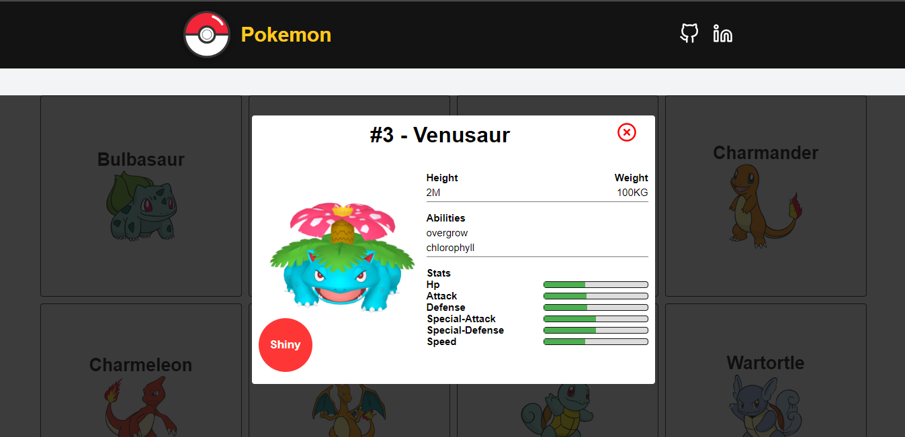

# Pokemon

**See the project online:**
https://pokemonjp.netlify.app/

# Descripition 

The project **Pokemon** is a project developed for studies. The purpose of the application is to create an application to connect to the **pokapi** and list all pokemon. Clicking on the pokemon card, a modal will open with more details about that specific pokemon. 

**API**
https://pokeapi.co/

  

## 🛠️ Features

- Connect to the API
- Consume the API
- Get the details about a specific Pokemon
- Load More pokemon
- Responsive site

## 📡 Technologies 

 

  

  

## 🔎 Project Status 

 

## 🌍 Find me

- [Linkedin](https://www.linkedin.com/in/joao-lopes-071026198/)